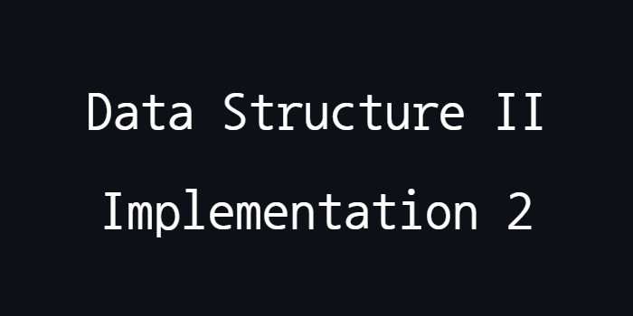

<p align="center">
  
</p>

## Overview

- This project implements diferent data structures such as AVL Tree, HashTables, and Multimap
- The Multimap data structure is used to store multiple values ​​associated with the same key
- The HashTable and AVL Tree are used to implement a simple plagiarism checker
<p>This project was developed during the Data Structure II course

## Features

- **AVL Trees**: Used for efficient data storage and retrieval, maintaining balance for optimal performance
- **HashTable**: Implements a key-value mapping for quick lookups and data storage
- **Multimap**: Supports multiple values for a single key
- **Plagiarism Detection**: The core functionality that checks for similarities in text. Checks plagiarism in more than one document and receives the number of consecutive identical words to find plagiarism
- **Complexity Analysis**: Evaluates and compares the performance and complexity of operations based on the chosen data structures.

## Problems

1. Implement a data structure that allows storing multiple values associated with the same key, a multimap. Choose an auxiliary data structure to implement the multimap. Describe how the insertion method (put) and the search method (findAll) of this structure work, including the complexities associated with each operation. Finally, perform an asymptotic analysis and verify the complexity of your structure.

2. Create a plagiarism checker for text documents. Use a variable m to control the number of consecutive identical words needed to check for plagiarism.
- **a)** Implement the checker using a hash table and verify the complexity of the structure.
- **b)** Implement the checker using either an AVL tree, a Red-Black tree, or a B-tree, and verify the complexity of the structure.
- **c)** Compare the complexities of the structures used and justify the choice of the tree in part b).

## Solving

- The complete report with the solutions can be accessed in this [PDF](pdf/Relatório.pdf)

## Installation and Usage
To compile and run this project, follow these steps:
1. Install Java JDK
2. Clone the repository:
   ```sh
   git clone https://github.com/GiuliaFreulon/data-structure-II-implementation-2
   cd data-structure-II-implementation-2
3. Compile the program:
   ```bash
   cd src
   javac -d ../bin Main.java
4. Run the program:
   ```bash
   cd ../bin
   java Main
   
## License
This project is licensed under the MIT License. See the [LICENSE](LICENSE) file for details.
